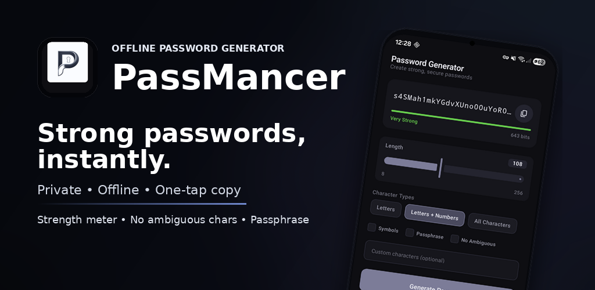
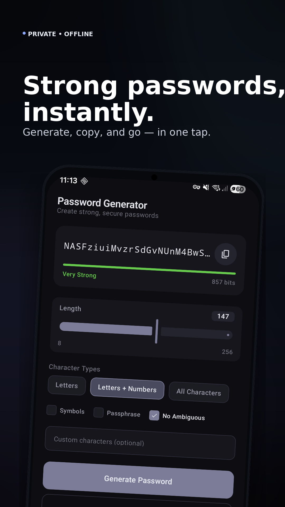
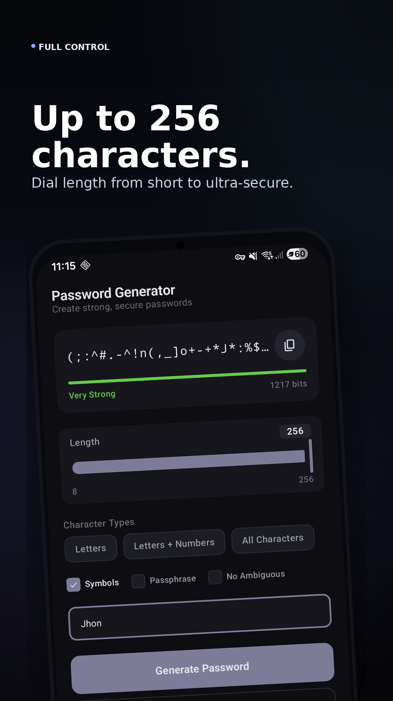
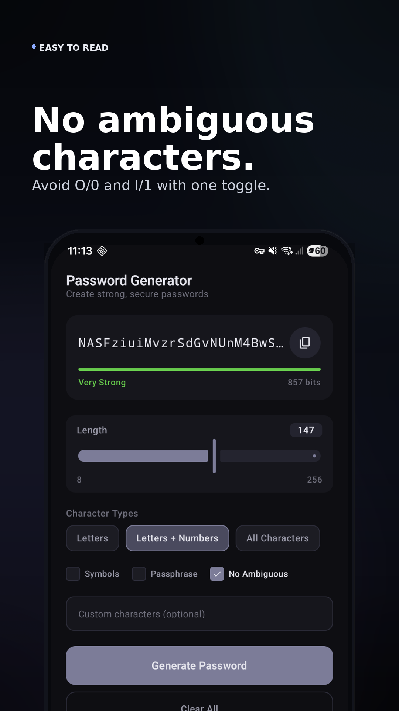
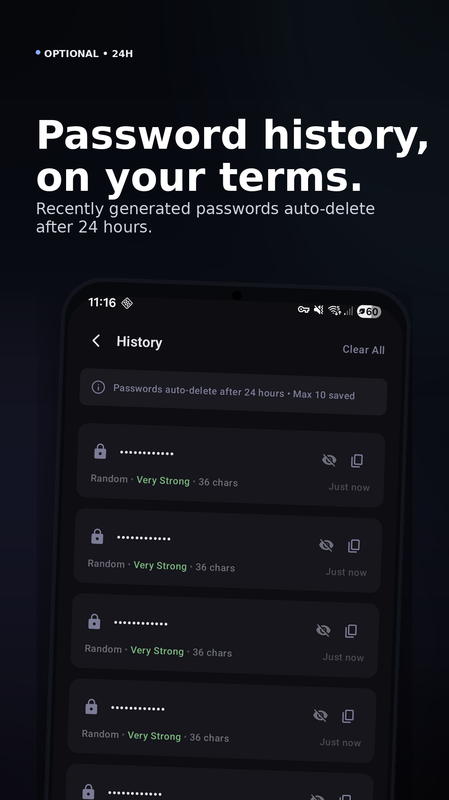
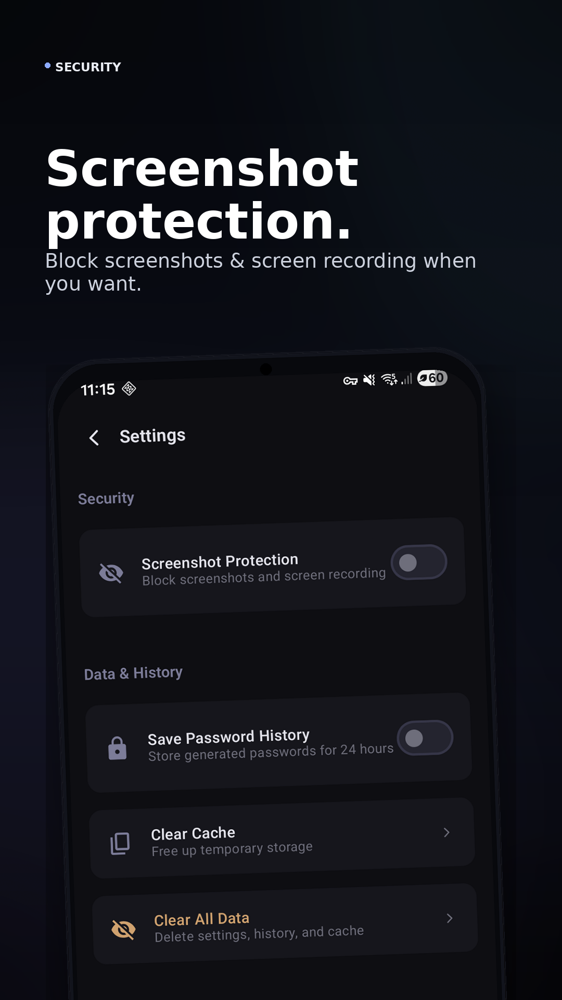
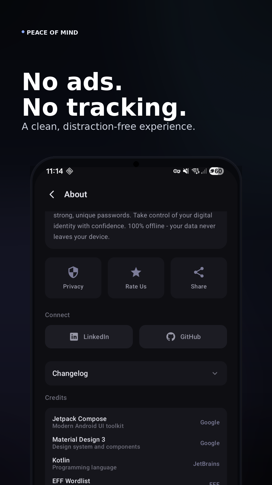
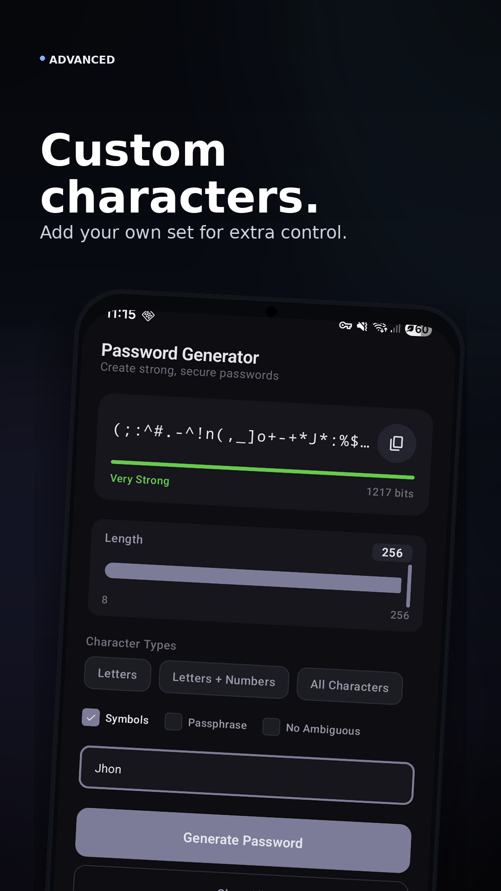
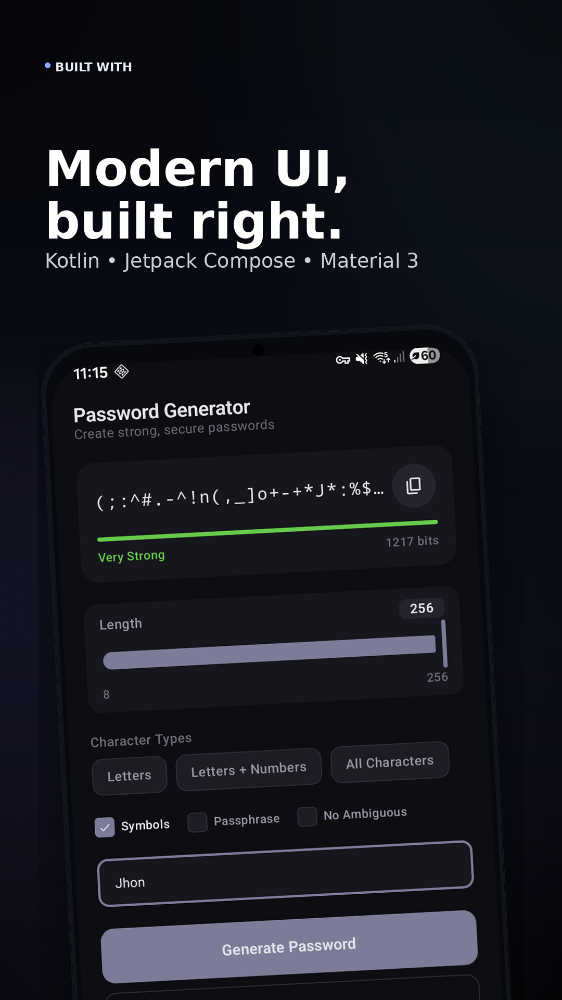

  

  <strong>Secure Password Generator for Android</strong>

  
  
  

  
  

## About

PassMancer is a modern, secure password generator app for Android. It helps you create strong, unique passwords to protect your online accounts.

Built with Kotlin and Jetpack Compose. Follows Material Design 3 guidelines.

## Features

- **Password Generator** — Create passwords up to 256 characters
- **Strength Meter** — Real-time entropy-based strength analysis
- **Multiple Options** — Uppercase, lowercase, numbers, symbols, custom characters
- **Password History** — View recently generated passwords (auto-deleted after 24 hours)
- **Screenshot Protection** — Block screenshots for security
- **Dark Theme** — Premium dark-only design
- **No Internet** — Works completely offline
- **No Ads** — Clean, distraction-free experience

## Screenshots

  
  
  
  

  
  
  
  

## Download

Or download the latest APK from [Releases](https://github.com/Pralhad-Nasane/PassMancer/releases).

## Tech Stack

| Technology | Purpose |
|------------|---------|
| Kotlin | Primary language |
| Jetpack Compose | UI framework |
| Material Design 3 | Design system |
| DataStore | Persistent storage |
| MVVM | Architecture pattern |

## Legal

- [Privacy Policy](PRIVACY_POLICY.md)
- [Terms and Conditions](TERMS_AND_CONDITIONS.md)
- [License](LICENSE.md)

## Developer

**Pralhad Nasane**

- GitHub: [@Pralhad-Nasane](https://github.com/Pralhad-Nasane)
- LinkedIn: [Pralhad Nasane](https://www.linkedin.com/in/pralhadnasane)

## Rate & Support

If you like PassMancer, please consider:

⭐ **Rate on Play Store** — Helps others discover the app  
🐛 **Bug Report** — [Report a bug](https://github.com/Pralhad-Nasane/PassMancer/issues/new?template=bug_report.md)  
💡 **Feature Request** — [Suggest a feature](https://github.com/Pralhad-Nasane/PassMancer/issues/new?template=feature_request.md)  
💬 **Feedback** — Reach out on LinkedIn

© 2025 PassMancer. All rights reserved.
